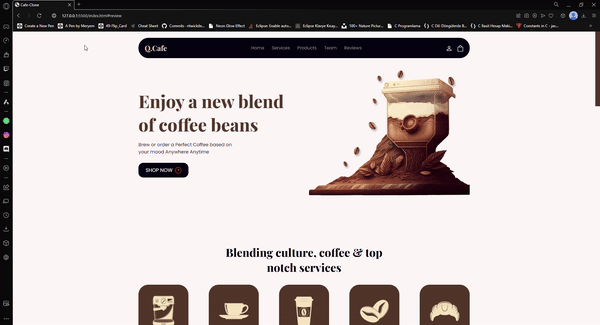

# ☕Q-CAFE

A modern and responsive cafe web page built using HTML5 and CSS3. It is a page that shows the positions of the employees, where customers can give comments and ratings, and includes all types of coffee.

# 📎Project Features

- Responsive Design: Adapts to various screen sizes.
- Clean and Modern UI: User-friendly and aesthetically pleasing design.
- HTML5: Utilizes semantic and structured coding.
- CSS3: Includes animations, transition effects, and media queries.

# 📸Preview
# Q-Cafe
